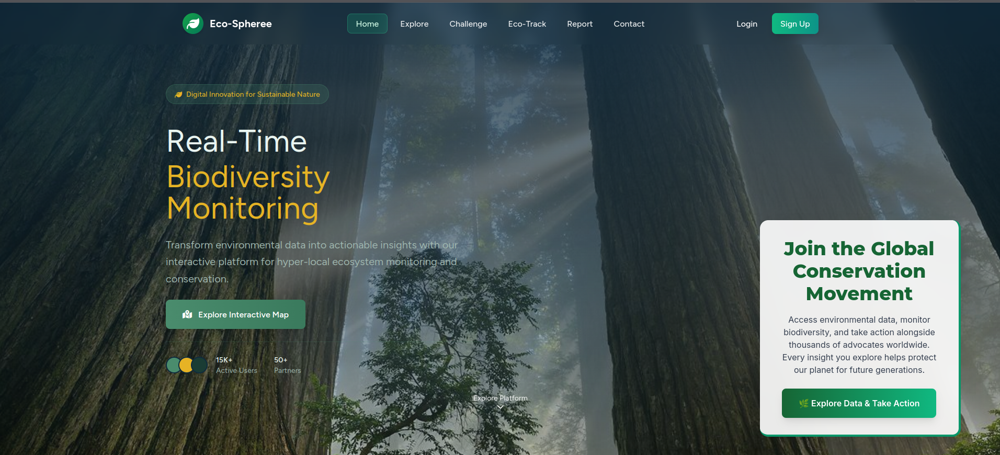
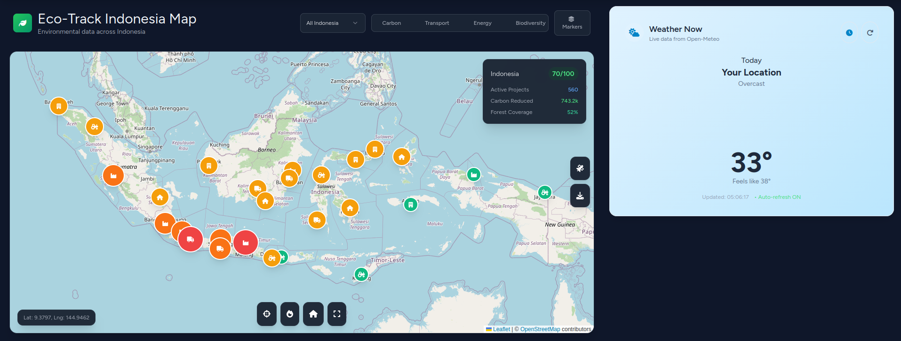
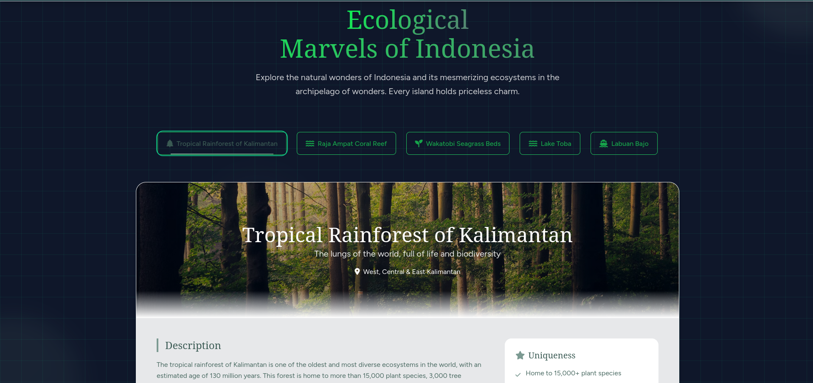
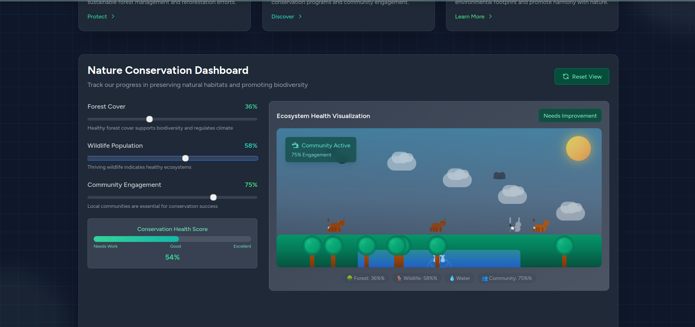
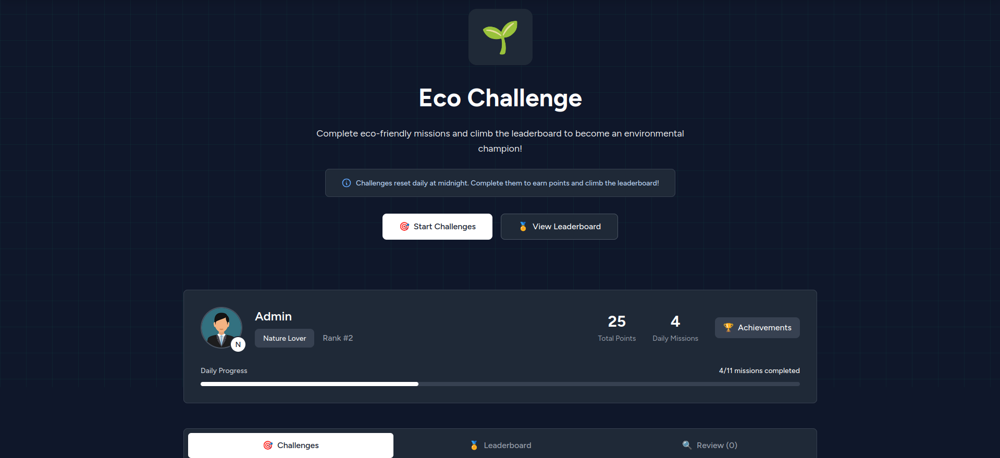
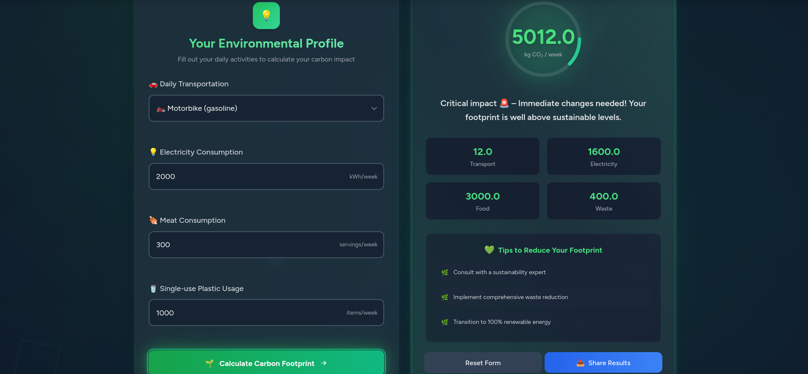
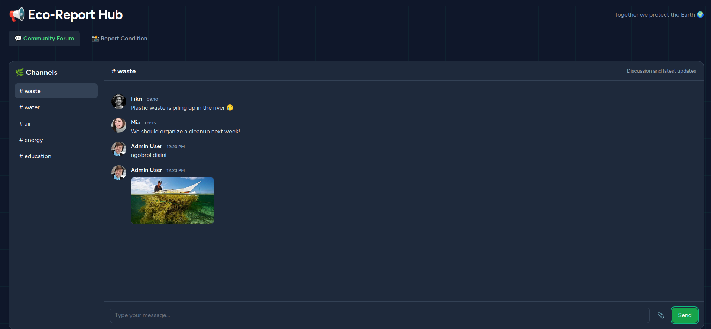
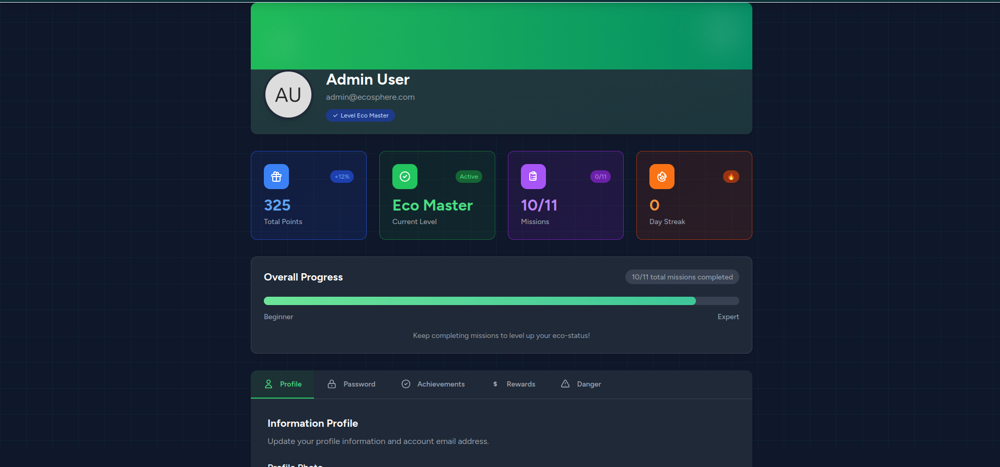
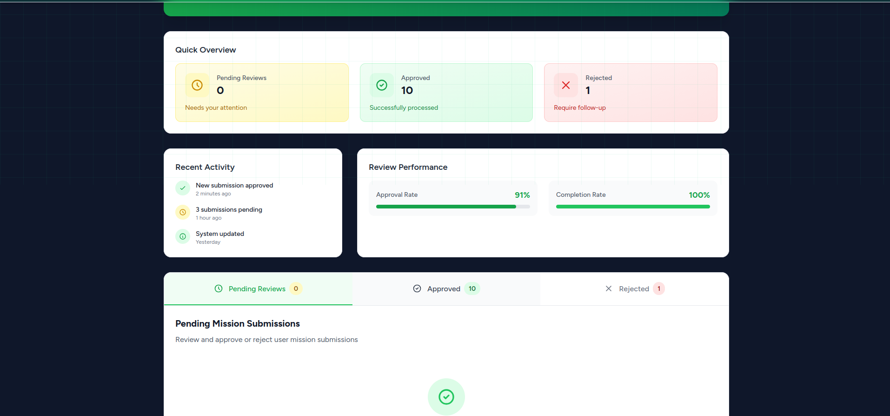

# Eco-Spheree 🌍

[](https://laravel.com)
[](https://php.net)
[](https://livewire.laravel.com)
[](https://opensource.org/licenses/MIT)



Eco-Spheree is a comprehensive web application built with Laravel that empowers users to engage in environmental challenges, track their ecological impact, and redeem rewards for sustainable actions. The platform promotes eco-friendly living through interactive challenges, progress tracking, and community-driven initiatives.

## 📋 Table of Contents

- [🖼️ Screenshots](#-screenshots)
- [✨ Features](#-features)
- [🛠️ Tech Stack](#️-tech-stack)
- [🚀 Installation](#-installation)
- [🎯 Usage](#-usage)
- [👨‍💼 Admin Access](#-admin-access)
- [📁 Project Structure](#-project-structure)
- [🛣️ Key Routes](#️-key-routes)
- [🧪 Testing](#-testing)
- [🤝 Contributing](#-contributing)
- [📄 License](#-license)
- [🙏 Acknowledgments](#-acknowledgments)

## 🖼️ Screenshots

### Homepage


### Explore Page




### Challenge Center


### Eco-Track


### Report Page


### User Profile


### Admin Dashboard


## ✨ Features

- **🔐 User Authentication**: Secure login and registration system with Laravel Breeze
- **🌱 Environmental Challenges**: Participate in various eco-challenges to earn points and levels
- **📊 Eco-Tracking**: Monitor personal environmental impact and progress
- **🎁 Reward System**: Redeem earned points for rewards and incentives
- **👨‍💼 Admin Panel**: Administrative interface for managing challenges, reviewing submissions, and overseeing user activities
- **🗺️ Interactive Maps**: Explore environmental data and conservation areas
- **🌤️ Weather Integration**: Real-time weather information for outdoor activities
- **📞 Contact System**: User support and partnership inquiries
- **📱 Responsive Design**: Mobile-friendly interface with dark mode support

## 🛠️ Tech Stack

### Backend
- **Laravel 12** - PHP web framework
- **PHP 8.2+** - Server-side scripting
- **Livewire 3.6** - Full-stack framework for Laravel
- **Laravel Breeze Middleware** - Authentication and session management

### Frontend
- **Tailwind CSS** - Utility-first CSS framework
- **Alpine.js** - Minimal framework for composing JavaScript behavior
- **Vite** - Fast build tool and dev server

### Database & Tools
- **MySQL/SQLite** - Database systems
- **Laravel Breeze** - Authentication scaffolding
- **PHPUnit** - Testing framework
- **Composer** - PHP dependency manager

## 🚀 Installation

### Prerequisites
- PHP 8.2 or higher
- Composer
- Node.js & npm
- MySQL or SQLite

### Setup Steps

1. **Clone the repository**
   ```bash
   git clone https://github.com/muhamadfikrii/Eco-Spheree.git
   cd Eco-Spheree
   ```

2. **Install PHP dependencies**
   ```bash
   composer install
   ```

3. **Install Node.js dependencies**
   ```bash
   npm install
   ```

4. **Environment configuration**
   ```bash
   cp .env.example .env
   php artisan key:generate
   ```

5. **Configure Environment Variables**
   Edit the `.env` file and configure the database settings:

   ```env
   # Database Configuration
   DB_CONNECTION=sqlite
   # For MySQL, use:
   # DB_CONNECTION=mysql
   # DB_HOST=127.0.0.1
   # DB_PORT=3306
   # DB_DATABASE=eco_spheree
   # DB_USERNAME=root
   # DB_PASSWORD=your_password
   ```

6. **Database setup**
   ```bash
   php artisan migrate
   php artisan db:seed
   ```

7. **Build assets**
   ```bash
   npm run build
   ```

## 🎯 Usage

### Development
Start the development environment with all services:
```bash
composer run dev
```

This command concurrently runs:
- Laravel server (`http://localhost:8000`)
- Laravel Pail for log monitoring
- Vite dev server for asset compilation

### Alternative Development Commands
You can also run services individually:
```bash
# Start Laravel server only
php artisan serve

# Start Vite dev server only
npm run dev

### Production
For production deployment:
```bash
php artisan config:cache
php artisan route:cache
php artisan view:cache
npm run build
```

## 👨‍💼 Admin Access

A default admin account is pre-configured:
- **Email**: `admin@ecosphere.com`
- **Password**: `password`

Use this account to access administrative features including mission reviews and user management.

## 📁 Project Structure

```
eco-spheree/
├── app/                          # Application code
│   ├── Http/Controllers/         # HTTP controllers
│   ├── Livewire/                 # Livewire components
│   ├── Models/                   # Eloquent models
│   └── Providers/                # Service providers
├── database/
│   ├── migrations/               # Database migrations
│   └── seeders/                  # Database seeders
├── public/                       # Public assets
├── resources/
│   ├── css/                      # Stylesheets
│   ├── js/                       # JavaScript files
│   └── views/                    # Blade templates
├── routes/
│   └── web.php                   # Web routes
├── storage/                      # File storage
├── tests/                        # Test files
└── vendor/                       # Composer dependencies
```

## 🛣️ Key Routes

| Route | Description | Auth Required | Middleware |
|-------|-------------|---------------|------------|
| `/` | Homepage | No | - |
| `/explore` | Exploration features and environmental maps | No | - |
| `/challenge` | Challenge listing and overview | No | - |
| `/challenge-center` | Interactive challenge center with Livewire components | Yes | `auth` |
| `/eco_track` | Environmental tracking dashboard | No | - |
| `/report` | Impact reports and analytics | Yes | `auth` |
| `/contact` | Contact form and partnership inquiries | No | - |
| `/profile` | User profile management | Yes | `auth` |
| `/onboarding` | User onboarding wizard | Yes | `auth` |
| `/admin/mission-reviews` | Admin panel for mission reviews | Yes | `auth`, `admin` |

## 🧪 Testing

Execute the test suite:
```bash
composer run test
```

## 📊 Project Metrics

[](https://github.com/your-username/eco-spheree/issues)
[](https://github.com/your-username/eco-spheree/stargazers)
[](https://github.com/your-username/eco-spheree/blob/main/LICENSE)

## 👥 Collaborators

This project is developed and maintained by:

- **Muhamad Fikri** - Project Lead & Full-Stack Developer
  - GitHub: [@muhamad-fikri](https://github.com/muhamadfikrii)

- **Agistiana Nurohman** - Frontend Developer
  - GitHub: [@sarah-johnson](https://github.com/agistiana)

## 🤝 Contributing

We welcome contributions! Please follow these steps:

1. Fork the repository
2. Create a feature branch: `git checkout -b feature/amazing-feature`
3. Commit your changes: `git commit -m 'Add amazing feature'`
4. Push to the branch: `git push origin feature/amazing-feature`
5. Open a Pull Request

### Development Guidelines
- Follow PSR-12 coding standards
- Write tests for new features
- Update documentation as needed
- Ensure responsive design for all new components

## 🐛 Issue Reporting

Found a bug? Please report it by opening an issue on GitHub with:
- Clear title and description
- Steps to reproduce
- Expected vs actual behavior
- Screenshots if applicable

## 📄 License

This project is licensed under the MIT License - see the [LICENSE](LICENSE) file for details.

## 🙏 Acknowledgments

- **Laravel Framework** - The PHP framework powering the application
- **Livewire** - For reactive components and seamless UX
- **Tailwind CSS** - For beautiful and responsive styling
- **Alpine.js** - For lightweight JavaScript interactions
- **Laravel Breeze** - For authentication scaffolding
- Environmental data providers and APIs
- Open-source community for inspiration and tools

---

<div align="center">
**Made with ❤️ for a greener planet**
</div>
